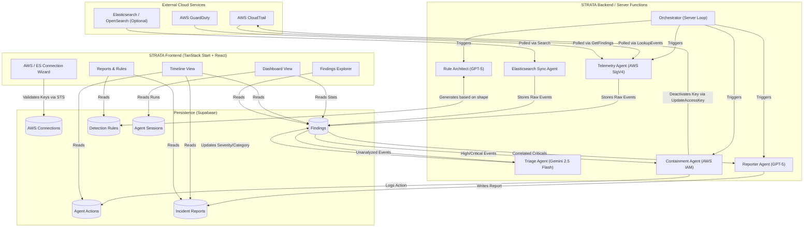

# STRATA
**Autonomous intrusion detection system for your AWS cloud.**

STRATA is built to eliminate the alert fatigue and manual toil inherent in modern cloud security operations. By simply connecting a read-only AWS IAM key, STRATA deploys a fleet of six specialized autonomous agents that handle the entire incident response lifecycle from end to end.

Instead of forcing a human analyst to sift through endless logs, STRATA continuously polls AWS CloudTrail and GuardDuty (across identity, API, network, data, and control planes), normalizes the telemetry, and instantly feeds it into advanced LLMs for triage. High-volume events are rapidly categorized and severity-scored by Google's Gemini 2.5 Flash, while deep-reasoning tasks—such as drafting account-specific detection rules and writing CISO-ready incident reports—are handled by OpenAI's GPT-5.

Furthermore, STRATA doesn't just alert you to danger; it can actively stop it. When auto-response is enabled, deterministic containment agents instantly revoke compromised IAM credentials the moment a critical threat is confirmed, shrinking the window of compromise from hours down to seconds. From rule generation to containment and final reporting, STRATA provides a fully automated, transparent, and highly accurate cloud defense solution requiring zero human intervention.

## System Architecture

<div align="center">
  <h3>Figure 1: STRATA System Architecture</h3>
</div>



### Flow-by-Flow Explanation

1. **Connection & Credential Validation:** User inputs read-only AWS IAM credentials (and optionally Elasticsearch credentials) in the STRATA frontend. The backend validates via `sts:GetCallerIdentity` (AWS SigV4) and encrypts/stores them securely in Supabase.
2. **Orchestration:** The Orchestrator Agent runs server-side on a scheduled interval (e.g. every 5 minutes), triggering the sequential agent pipeline.
3. **Rule Architect:** Powered by GPT-5, this agent generates a tailored baseline detection ruleset for the connected AWS account.
4. **Telemetry Sync:** The Telemetry Agent queries CloudTrail and GuardDuty via deterministic AWS APIs to retrieve recent events. If Elasticsearch is connected, the Elasticsearch Sync Agent concurrently pulls logs. All raw events are stored in the findings table.
5. **Triage:** The Triage Agent (Gemini 2.5 Flash) processes the unanalyzed findings, scoring severity, classifying categories, writing human-readable summaries, and suggesting remediation actions.
6. **Containment:** If auto-response is enabled, the Containment Agent scans for critical, IAM-based threats and instantly disables the compromised Access Keys via `iam:UpdateAccessKey` requests.
7. **Reporting:** The Reporter Agent (GPT-5) clusters correlated high/critical findings over the last 24 hours to automatically draft an executive-level incident report.
8. **Frontend Visualization:** The user interface fetches enriched findings, reports, and agent actions from Supabase for display across the Dashboard, Timeline, and Findings modules.

## Technical Documentation

For a comprehensive explanation of every feature, agent role, and internal capability, please see the [Technical Documentation](./TECHNICAL_DOCUMENTATION.md).

## Tech Stack

* **Frontend:** React 19, Vite, Tailwind CSS 4, Radix UI, Lucide React.
* **Framework:** TanStack Start (Server Functions) & TanStack Router.
* **Backend & Persistence:** Supabase (PostgreSQL, Row Level Security, Edge Functions via Server integrations).
* **AI & LLMs:** Lovable AI Gateway integrating Google Gemini 2.5 Flash (high-volume triage) and OpenAI GPT-5 (deep reasoning).
* **Cloud Integration:** Native AWS Signature V4 signing, pure fetch-based API integration (CloudTrail, GuardDuty, STS, IAM), Elasticsearch / OpenSearch query integration.
* **Security:** AES-256-GCM encryption for stored AWS secrets.

## Setup & Installation Instructions

To get the STRATA application setup and running locally:

1. Clone the repository and install dependencies:
   ```bash
   npm install
   ```
2. Make sure you have your Supabase environment variables set (e.g. `VITE_SUPABASE_URL`, `VITE_SUPABASE_ANON_KEY`, and potentially `SUPABASE_SERVICE_ROLE_KEY` if running local scripts) and your Lovable API key (`LOVABLE_API_KEY`) available in a `.env` file.
3. Start the development server:
   ```bash
   npm run dev
   ```

**Connecting AWS:**
Once the application is running and you have logged in, **to see the instructions on how to connect the application to an AWS account, click the "Connect AWS" tab in the STRATA application.** The wizard will walk you through creating a secure, read-only IAM user for STRATA.

Once your account is successfully connected, you will see a connected status banner on this same page. Here, you have the option to click the **Enable auto-response** button. By default, STRATA operates with strictly read-only permissions. Enabling auto-response opts you in to active containment, allowing the Containment Agent to issue `iam:UpdateAccessKey` requests to instantly revoke compromised IAM credentials the moment a critical threat is detected.

**Connecting Elasticsearch / OpenSearch:**
In the same "Connect AWS" tab, you can connect an Elasticsearch cluster. **Please note that Elasticsearch findings are additive to AWS findings and that users must click Sync (or enable auto-sync) to pull logs into the STRATA pipeline.**
