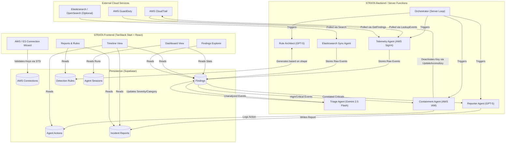

# Technical Documentation

## Executive Summary

STRATA is an autonomous, agent-based intrusion detection system (IDS) built specifically for AWS cloud environments. It completely removes the need for human analysts to manually sift through massive volumes of CloudTrail logs and GuardDuty alerts. Instead, a fleet of AI-driven and deterministic agents operates continuously to ingest, analyze, correlate, and respond to threats in near real-time. By leveraging large language models (LLMs) like Google's Gemini 2.5 Flash and OpenAI's GPT-5, STRATA generates account-specific detection rules, triages events at scale, contains threats automatically by disabling compromised IAM access keys, and authors executive-level incident reports.

## Table of Contents

1. [Executive Summary](#executive-summary)
2. [System Architecture](#system-architecture)
   - [Architecture Diagram](#architecture-diagram)
   - [Flow-by-Flow Explanation](#flow-by-flow-explanation)
3. [Feature Details](#feature-details)
   - [Autonomous Agents](#autonomous-agents)
   - [User Interface Modules](#user-interface-modules)
   - [Sandbox Environment](#sandbox-environment)
   - [Elasticsearch Integration](#elasticsearch-integration)
4. [Conclusion](#conclusion)

---

## System Architecture

### Architecture Diagram

  <h3>Figure 1: STRATA System Architecture</h3>

### Flow-by-Flow Explanation

1. **Connection & Credential Validation**
   - The user inputs read-only AWS IAM credentials (and optionally Elasticsearch credentials) into the STRATA frontend.
   - The backend validates the AWS credentials using `sts:GetCallerIdentity` via standard AWS Signature V4 signing.
   - Upon successful validation, the credentials are encrypted (AES-256-GCM) and stored securely within the Supabase database.

2. **Orchestration**
   - The **Orchestrator Agent** initiates cycles from the backend. The dashboard automatically signals the orchestrator to kick off an analysis cycle immediately upon connection and subsequently runs intervals (e.g., every 5 minutes).
   - This starts the pipeline: Rule Generation → Telemetry Syncing → Event Triage → Automated Containment → Incident Reporting.

3. **Rule Architect (Rule Generation)**
   - The **Rule Architect Agent**, powered by OpenAI's GPT-5, analyzes the specific shape of the connected AWS account.
   - It generates tailored baseline detection rules, complete with MITRE ATT&CK techniques, descriptions, and severities, storing them in the `detection_rules` table.

4. **Telemetry Sync (Data Ingestion)**
   - The **Telemetry Agent** runs securely utilizing pure deterministic AWS API calls (SigV4).
   - It queries AWS CloudTrail (via `CloudTrail_20131101.LookupEvents`) and AWS GuardDuty (via `GetFindings`) to retrieve the latest events from the past 24 hours.
   - Concurrently, if an Elasticsearch cluster is connected, the **Elasticsearch Sync Agent** will query the cluster for recent logs.
   - All pulled raw events are normalized and temporarily stored in the `findings` table as unanalyzed.

5. **Triage Agent (Event Classification)**
   - Unanalyzed findings are batched and sent to the **Triage Agent**, powered by Google's Gemini 2.5 Flash.
   - The LLM classifies each event's category, scores its severity (Low, Medium, High, Critical), produces a one-line human-readable summary, and recommends concrete remediation steps.
   - The `findings` table records are updated with these AI attributes.

6. **Containment Agent (Auto-Response)**
   - If auto-response is enabled by the user, the deterministic **Containment Agent** kicks in.
   - It searches for newly analyzed findings marked as "Critical" that indicate compromised IAM credentials.
   - Once a compromised key is detected, the agent signs an `iam:UpdateAccessKey` request (using the connected account credentials) to forcefully deactivate the compromised key in the user's AWS account.
   - The containment attempt (success or failure) is logged in the `agent_actions` table.

7. **Reporter Agent (Incident Reporting)**
   - The **Reporter Agent** uses GPT-5 to look for high/critical findings correlated within a 24-hour window.
   - When clustered findings are identified, it automatically authors a comprehensive Incident Report.
   - The report contains an executive summary, MITRE tactic mapping, affected resources, a detailed chronological timeline, and step-by-step remediation instructions. This is stored in the `incident_reports` table.

8. **Frontend Visualization**
   - The React-based frontend components fetch the parsed and enriched data from Supabase.
   - Users can view real-time statistics on the Dashboard, scroll through a chronological Timeline of actions, explore raw Findings, investigate Auto-blocked Actions, and read detailed Reports & Rules.

---

## Feature Details

### Autonomous Agents

Every process in STRATA is offloaded to one of six specialized autonomous agents. None of them require human intervention after the initial connection.

* **Rule Architect:** Uses a deep-reasoning model (GPT-5) to draft a tailored detection ruleset. Instead of static, hardcoded rules, the architect provides rules tagged with MITRE techniques, severity scores, and account-specific contexts.
* **Telemetry:** A deterministic agent executing signed AWS API calls. It pulls CloudTrail and GuardDuty findings on every cycle and normalizes disparate events into a single stream for processing.
* **Triage:** Powered by Gemini 2.5 Flash for high-volume analysis. It reads the raw JSON of every ingested event and provides four outputs: severity, category, a 2-3 sentence explanation, and a specific remediation action.
* **Containment:** A deterministic agent that takes action. If a critical threat is linked to a specific IAM Access Key, this agent calls `iam:UpdateAccessKey` to immediately deactivate the key.
* **Reporter:** Powered by GPT-5. Instead of alerting the user for every single finding, it stitches correlated high and critical severity findings into full incident reports written for a CISO, complete with a timeline and affected resources.
* **Orchestrator:** The server loop that ensures the five agents above run sequentially on a reliable cadence.

### User Interface Modules

* **Dashboard (`/app/`):** The primary view. It shows connection health, high-level threat statistics (Total events, Critical/High counts), recent findings, and active agent status.
* **Timeline (`/app/timeline`):** An aggregated chronological view combining findings, agent actions (like auto-blocks and rules created), and incident reports into one stream.
* **Findings (`/app/findings`):** A searchable, filterable grid of all raw and AI-analyzed events spanning CloudTrail, GuardDuty, and Elasticsearch. Users can drill down to see the raw JSON alongside the AI explanation.
* **Auto-blocks (`/app/blocked`):** A dedicated interface showing every containment action taken by the Containment agent. Includes an "Explain" button that uses Gemini to explain why the block was issued based on the triggering evidence.
* **Reports & Rules (`/app/reports`):** A dual-purpose view. It displays the clustered incident reports generated by the Reporter agent, and the underlying detection rules drafted by the Rule Architect.
* **History (`/app/history`):** A snapshot view. When users choose to "Clear Session" from the dashboard, the current run counts, findings, and reports are rolled up into an archived session for auditing purposes.
* **Connect AWS (`/app/connect`):** The setup wizard where users input their AWS IAM credentials, toggle auto-response permissions, configure Elasticsearch, and manage mock data.

### Sandbox Environment

To allow users to evaluate STRATA without generating real malicious traffic in their AWS accounts, the platform includes a Sandbox seeder.
* Located within the "Connect AWS" tab, the Sandbox inserts realistic mock CloudTrail logs.
* Mock data covers multi-stage attack scenarios including privilege escalation, persistence (creating new IAM keys), and defense evasion.
* Because the findings flow into the same database as real events, it activates the entire pipeline: rules are generated, AI triage is run, and reports are written.

### Elasticsearch Integration

STRATA supports aggregating security findings beyond native AWS APIs.
* Users can connect an existing Elasticsearch or OpenSearch cluster containing external logs (like application logs or alternative SIEM feeds).
* The **Elasticsearch Sync Agent** uses an API key to securely query the cluster.
* Findings pulled from Elasticsearch are strictly **additive** to AWS findings.
* Note: Elasticsearch syncing requires the user to click the "Sync" button (or enable auto-sync), at which point logs are normalized and run through the exact same Triage and Reporter agents as standard CloudTrail logs.

---

## Conclusion

STRATA transforms cloud security from a manual, alert-fatigue-inducing process into an autonomous operation. By dividing labor among specialized AI and deterministic agents, the system achieves sub-minute triage for thousands of events, instant containment of critical threats, and human-readable reporting. Its secure, read-only-by-default architecture ensures that users retain absolute control over their environment while benefiting from enterprise-grade intrusion detection.
